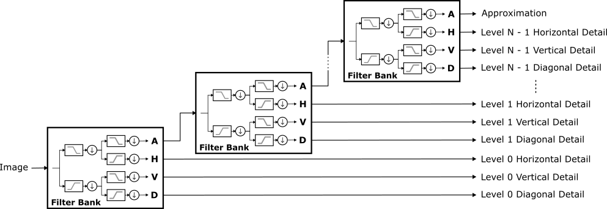

.. _dwt:

Discrete Wavelet Transform (DWT)
================================
.. cpp:namespace:: wtcv
.. cpp:namespace-push:: DWT2D

    Discrete Wavelet Transform Block Diagram

Image decomposition (i.e. analysis or forward transformation) is performed
by :cpp:func:`decompose`.

.. code-block:: cpp

    #include <wtcv/dwt2d.hpp>
    using namespace wtcv;

    cv::Mat image = ...;
    DWT2D dwt(Wavelet::create("db2"));
    DWT2D::Coeffs coeffs = dwt.decompose(image);

Alternatively, :cpp:class:`DWT2D` objects are functors.

.. code-block:: cpp

    DWT2D::Coeffs coeffs = dwt(image);

A third option is the functional interface.

.. code-block:: cpp

    DWT2D::Coeffs coeffs = dwt2d(image, "db2");

Image reconstruction (i.e. synthesis or inverse transformation) is
accomplished with :cpp:func:`reconstruct`

.. code-block:: cpp

    cv::Mat reconstructed_image = dwt.reconstruct(coeffs);

or :cpp:func:`DWT2D::Coeffs::reconstruct`.

.. code-block:: cpp

    cv::Mat reconstructed_image = coeffs.reconstruct();

.. cpp:namespace-pop::

Coefficients
------------

.. cpp:namespace-push:: DWT2D::Coeffs

This :cpp:class:`DWT2D::Coeffs` is a **view** onto a :cpp:class:`cv::Mat` containing the DWT coefficients.
The coefficients at each decomposition level are comprised of three
submatrices: the horizontal detail subband, the vertical detail subband,
and the diagonal detail subband.
There is a single submatrix of approximation coefficients stored
alongside the coarsest details.
Smaller level indices correspond to smaller scales (i.e. higher
resolutions).  The submatrices are layed out as (a 4-level decomposition
is shown for illustration):

.. include:: snippets/coeffstable.rst

The regions labeled H0, V0, and D0 are the level 0 (i.e. finest)
horizontal, vertical, and diagonal detail subbands, respectively.
Likewise, H1, V1, and D1 are the level 1 coefficients, H2, V2, and D2
are the level 2 coefficients, and H3, V3, and D3 are the level 3
(i.e. coarsest) coefficients.
The approximation coefficients are labeled A.

Constructing DWT2D::Coeffs Objects
^^^^^^^^^^^^^^^^^^^^^^^^^^^^^^^^^^

:cpp:class:`DWT2D::Coeffs` objects are created by one of the following methods:

    1. Computed by :cpp:func:`DWT2D::decompose`
    2. Cloned by :cpp:func:`clone`, :cpp:func:`empty_clone`, or :cpp:func:`clone_and_assign`
    3. Created by :cpp:func:`DWT2D::create_coeffs` or :cpp:func:`DWT2D::create_empty_coeffs`

The third method is less common and is only used when the coefficients
are generated algorithmically (as opposed to transforming an image).

The only caveat is that default constructed :cpp:class:`DWT2D::Coeffs` can be used as
:cpp:func:`DWT2D::decompose` or :cpp:func:`dwt2d` output parameters.

.. code-block:: cpp

    cv::Mat image = ...;
    DWT2D::Coeffs coeffs;
    // Coefficients are passed as an output parameter.
    dwt2d(image, coeffs);

But, this can be accompished with

.. code-block:: cpp

    cv::Mat image = ...;
    // Coefficients are returned.
    DWT2D::Coeffs coeffs = dwt2d(image);

The performance should be comparable because :cpp:class:`DWT2D::Coeffs` are moveable.
The difference is a matter of style.  The first method is more
idiomatic of OpenCV code while the second is a bit more succinct.

Interoperability With OpenCV
^^^^^^^^^^^^^^^^^^^^^^^^^^^^

Converting Between cv::Mat And DWT2D::Coeffs
""""""""""""""""""""""""""""""""""""""""""""

:cpp:class:`DWT2D::Coeffs` objects are implicitly converted to cv::Mat.

.. code-block:: cpp

    DWT2D::Coeffs coeffs = ...;

    // DWT2D::Coeffs can be assigned to a cv::Mat.
    cv::Mat matrix = coeffs;

    // Functions that accept a cv::Mat also accept a DWT2D::Coeffs.
    void foo(const cv::Mat& matrix) {...}
    foo(coeffs);

.. warning::
    Converting a :cpp:class:`DWT2D::Coeffs` to a cv::Mat **discards the metadata**
    that defines the subband submatrices and the associated :cpp:class:`DWT2D`.

    .. code-block:: cpp

        // The matrix has the same numerical data but can no longer be used as
        // a DWT2D::Coeffs because the metadata has been lost.
        cv::Mat matrix = coeffs;

.. warning::
    Converting a :cpp:class:`DWT2D::Coeffs` to a cv::Mat returns the private
    cv::Mat member.  Since cv::Mat objects **share the underlying data**,
    any modification of the matrix is a modification of the coefficients.

    .. code-block:: cpp

        // Be careful, matrix and coeffs share the same data.
        // This sets all matrix elements and coefficients to zero.
        cv::Mat matrix = coeffs;
        matrix = 0.0;

Converting a cv::Mat to a :cpp:class:`DWT2D::Coeffs` is done in one of two ways -
in each case an existing :cpp:class:`DWT2D::Coeffs` object is required to provide the
necessary metadata.

    1. Use :cpp:func:`clone_and_assign` on the existing coefficients

    .. code-block:: cpp

        auto new_coeffs = coeffs.clone_and_assign(matrix);

    2. Assignment to the existing coefficients

    .. code-block:: cpp

        coeffs = matrix;

Calling OpenCV Functions
""""""""""""""""""""""""

:cpp:class:`DWT2D::Coeffs` objects are implicitly converted to
cv::InputArray, cv::OutputArray, and cv::InputOutputArray.  In each case the
array is initialized with the private cv::Mat member. Since cv::Mat objects share the
underlying data, any modification of the array's matrix is a
modification of the coefficients.  This means that :cpp:class:`DWT2D::Coeffs` **can be
passed to any OpenCV function and acted on like a normal cv::Mat**.

.. rubric:: Output Arguments

Many OpenCV functions return their result via an output argument.
Consider the taking the log:

.. code-block:: cpp

    cv::Mat log_coeffs;
    cv::log(coeffs, log_coeffs);

This does correctly compute ``log_coeffs``, but it loses the :cpp:class:`DWT2D::Coeffs`
metadata.

To make ``log_coeffs`` a :cpp:class:`DWT2D::Coeffs`, and not just a cv::Mat,
initialize it with :cpp:func:`empty_clone`.

.. code-block:: cpp

    DWT2D::Coeffs log_coeffs = coeffs.empty_clone();
    cv::log(coeffs, log_coeffs);

.. cpp:namespace-pop::

.. admonition:: API Reference

    :ref:`dwt_api`

