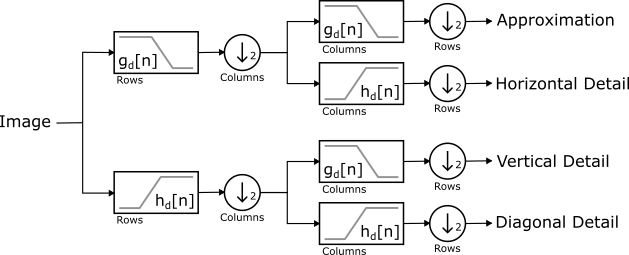
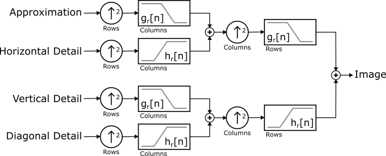

.. _wavelet:

Wavelets
========

Wavelet Objects
---------------
.. cpp:namespace:: wtcv
.. cpp:namespace-push:: Wavelet

Given a continuous **scaling function** :math:`\phi(t)` and a continuous
**wavelet function** :math:`\psi(t)`, the discrete wavelet transform (DWT) of a
continuous function :math:`x(t)` is the projection onto the *discrete* basis of
*continuous* functions defined by

.. math::

    \big{\{} \phi_{0, n}(t) \, \vert \, n \in \mathbb{Z} \big{\}} \cup \big{\{} \psi_{i, n}(t) \, \vert \, i \in \mathbb{N}, n \in \mathbb{Z} \big{\}}

where

.. math::

    \phi_{i, n}(t) = 2^{-i / 2} \, \phi(2^{-i} t - n)
    \quad \text{and} \quad
    \psi_{i, n}(t) = 2^{-i / 2} \, \psi(2^{-i} t - n)

That is, the DWT coefficients are

.. math::

    \langle x, \phi_{0, n} \rangle = \int x(t) \, \phi_{0, n}(t) \, dt
    \quad \text{and} \quad
    \langle x, \psi_{i, n} \rangle = \int x(t) \, \psi_{i, n}(t) \, dt

A :cpp:class:`Wavelet` object represents a compactly supported wavelet function
:math:`\psi(t)` and scaling function :math:`\phi(t)` in a way that is well
suited for implementing discrete wavelet transforms.
Specifically, it uses a FIR filter bank as prescribed by Mallet in his
multiresolution analysis theory.

.. note::

    Computationly, the function :math:`x(t)` is represented discretely by :math:`N`
    samples.
    This forces the scale parameter :math:`i` to be finite, the
    translation parameter :math:`n` to run from :math:`0` to :math:`N`, and
    :math:`\langle \cdot, \cdot \rangle` to be a sum instead of an integral.

Filter Bank
^^^^^^^^^^^

Given four discrete sets of coefficients, namely :math:`g_d[n]`, :math:`h_d[n]`,
:math:`g_r[n]`, and :math:`h_r[n]`, a wavelet function :math:`\psi(t)` and
scaling function :math:`\phi(t)` are *implicitly* defined by

.. math::

    \phi_{i, 0}(t) = \sum_n g_d[n] \phi_{i - 1, n}(t) = \sum_n g_r[n] \phi_{i + 1, n}(t)

.. math::

    \psi_{i, 0}(t) = \sum_n h_d[n] \phi_{i - 1, n}(t) = \sum_n h_r[n] \phi_{i + 1, n}(t)

For well defined wavelets, the coefficients must satisify an admissibility
constraint.  Additional constraints are often imposed to enusre various
properties such as orthogonality, regularity, etc. See "Wavelets and Filter Banks"
by Strang & Nguyen for the details.

One of the principal advantages of this formulation is that the
:ref:`multiscale DWT <dwt>` can be realized by recursive applications of a
:cpp:func:`filter_bank()` that uses these coefficients as convolution kernels.

.. rubric:: Decomposition

Image decomposition is accomplished by a two stage cascade where each stage is a
two channel filter bank consisting of a lowpass filter :math:`g_d[n]` and a
highpass filter :math:`h_d[n]`.  At each stage, both channels are downsampled by
a factor of two.  The first stage convolves along rows and downsamples columns.
The second stage convolves along columns and downsamples rows. This results in
four outputs:

- Approximation Subband Coefficients (Lowpass-Lowpass)
- Horizontal Detail Subband Coefficients (Lowpass-Highpass)
- Vertical Detail Subband Coefficients (Highpass-Lowpass)
- Diagonal Detail Subband Coefficients (Highpass-Highpass)

    Decomposition Block Diagram

.. rubric:: Reconstruction

Image reconstruction revserses the signal flow, uses the reconstruction kernels
:math:`g_r[n]` and :math:`h_r[n]`, and upsamples instead of downsampling.

    Reconstruction Block Diagram

.. rubric:: Accessing Filter Bank Kernels

For some wavelet

.. code-block:: cpp

    Wavelet wavelet = ...;

the decomposition kernels are

.. code-block:: cpp

    wavelet.filter_bank().decompose_kernels().lowpass();
    wavelet.filter_bank().decompose_kernels().highpass();

and the reconstruction kernels are

.. code-block:: cpp

    wavelet.filter_bank().reconstruct_kernels().lowpass();
    wavelet.filter_bank().reconstruct_kernels().highpass();

Properties
^^^^^^^^^^

Each wavelet object has a :cpp:func:`name` and :cpp:func:`family` name.
Whenever possible, the :cpp:func:`name` uniquely identifies the filter bank
used to define the wavelet.  This is true for all predefined wavelets.

Wavelets have the additional properties:

    - :cpp:func:`orthogonality`
    - :cpp:func:`symmetry`
    - :cpp:func:`wavelet_vanishing_moments`
    - :cpp:func:`scaling_vanishing_moments`

.. cpp:namespace-pop::

Predefined Wavelets
-------------------

The following predefined wavelets can be constructed by the indicated
factory or by :cpp:func:`Wavelet::create` using one of the indicated names.

- Haar
    - Factory: :cpp:func:`create_haar`
    - Names: haar

- Daubechies
    - Factory: :cpp:func:`create_daubechies`
    - Names: db1, db2, ..., db38

- Symlets
    - Factory: :cpp:func:`create_symlets`
    - Names: sym2, sym3, ..., sym20

- Coiflets
    - Factory: :cpp:func:`create_coiflets`
    - Names: coif1, coif2, ..., coif17

- Biorthogonal
    - Factory: :cpp:func:`create_biorthogonal`
    - Names:
        - bior1.1
        - bior1.3
        - bior1.5
        - bior2.2
        - bior2.4
        - bior2.6
        - bior2.8
        - bior3.1
        - bior3.3
        - bior3.5
        - bior3.7
        - bior3.9
        - bior4.4
        - bior5.5
        - bior6.8

- Reverse Biorthognal
    - Factory: :cpp:func:`create_reverse_biorthogonal`
    - Names:
        - rbior1.1
        - rbior1.3
        - rbior1.5
        - rbior2.2
        - rbior2.4
        - rbior2.6
        - rbior2.8
        - rbior3.1
        - rbior3.3
        - rbior3.5
        - rbior3.7
        - rbior3.9
        - rbior4.4
        - rbior5.5
        - rbior6.8

Custom Wavelets
---------------
.. cpp:namespace-push:: FilterBank

Custom wavelets are created by providing a :cpp:class:`FilterBank` constructed
directly from four kernels or by one of the factory functions:

    - :cpp:func:`FilterBank::create_orthogonal`
    - :cpp:func:`FilterBank::create_biorthogonal`
    - :cpp:func:`FilterBank::create_conjugate_mirror`
    - :cpp:func:`FilterBank::create_quadrature_mirror`

.. cpp:namespace-pop::
.. cpp:namespace-push:: Wavelet

It is encouraged, but not required, that each wavelet is given a
:cpp:func:`name` and :cpp:func:`family`. If possible, the name should uniquely
identify the filter bank. See the naming schemes used for the builtin wavelets
for examples.

.. cpp:namespace-pop::
.. cpp:namespace-push:: FilterBank

Create a wavelet from filter bank kernels.

.. code-block:: cpp

    cv::Mat decomposition_lowpass_kernel = ...;
    cv::Mat decomposition_highpass_kernel = ...;
    cv::Mat reconstruction_lowpass_kernel = ...;
    cv::Mat reconstruction_highpass_kernel = ...;

    auto filter_bank = FilterBank(
        decomposition_lowpass_kernel,
        decomposition_highpass_kernel,
        reconstruction_lowpass_kernel,
        reconstruction_highpass_kernel
    );

    auto wavelet = Wavelet(filter_bank, "myname", "My Family");

.. cpp:namespace-pop::
.. cpp:namespace-push:: Wavelet

Or equivalently, use the convienence :cpp:class:`Wavelet` constructor to skip
creating the filter bank directly.

.. cpp:namespace-pop::
.. cpp:namespace-push:: FilterBank

.. code-block:: cpp

    // The filter bank is built internally.
    auto wavelet = Wavelet(
        decomposition_lowpass_kernel,
        decomposition_highpass_kernel,
        reconstruction_lowpass_kernel,
        reconstruction_highpass_kernel,
        "myname",
        "My Family"
    );

When a wavelet is constructed from four filter kernels, it is up to the user to
ensure that the wavelet is well defined. The :cpp:func:`satisfies_alias_cancellation`,
:cpp:func:`satisfies_no_distortion`, :cpp:func:`is_biorthogonal`, and
:cpp:func:`is_orthogonal` functions may be helpful in this regard.

.. cpp:namespace-pop::

Orthogonal Wavelets
^^^^^^^^^^^^^^^^^^^

.. cpp:namespace-push:: FilterBank

Use the :cpp:func:`FilterBank::create_orthogonal` factory to create an
orthogonal wavelet from a reconstruction lowpass kernel.

.. code-block:: cpp

    cv::Mat reconstruction_lowpass_kernel = ...;
    auto filter_bank = FilterBank::create_orthogonal(reconstruction_lowpass_kernel);

    auto wavelet = Wavelet(filter_bank, "myname", "My Family");

.. cpp:namespace-pop::
.. cpp:namespace-push:: Wavelet

Or equivalently, use the convienence :cpp:class:`Wavelet` constructor to skip
creating the filter bank directly.

.. cpp:namespace-pop::
.. cpp:namespace-push:: FilterBank

.. code-block:: cpp

    // The filter bank is built internally using FilterBank::create_orthogonal.
    auto wavelet = Wavelet(reconstruction_lowpass_kernel, "myname", "My Family");

:cpp:func:`FilterBank::create_orthogonal` normalizes the kernel using the L2
norm before creating a conjugate mirror filter bank and ensuring that the filter
bank :cpp:func:`is_orthogonal`.
Use :cpp:func:`FilterBank::create_conjugate_mirror` to avoid the normalization
and the :cpp:func:`is_orthogonal` check.

.. cpp:namespace-pop::

Biorthogonal Wavelets
^^^^^^^^^^^^^^^^^^^^^

.. cpp:namespace-push:: FilterBank

Use the :cpp:func:`FilterBank::create_biorthogonal` factory to create a
biorthogonal wavelet from a pair of reconstruction and decomposition lowpass
kernels.

.. code-block:: cpp

    cv::Mat reconstruction_lowpass_kernel = ...;
    cv::Mat decomposition_lowpass_kernel = ...;
    auto filter_bank = FilterBank::create_biorthogonal(
        reconstruction_lowpass_kernel,
        decomposition_lowpass_kernel
    );

    auto wavelet = Wavelet(filter_bank, "myname", "My Family");

.. cpp:namespace-pop::
.. cpp:namespace-push:: Wavelet

Or equivalently, use the convienence :cpp:class:`Wavelet` constructor to skip
creating the filter bank directly.

.. cpp:namespace-pop::
.. cpp:namespace-push:: FilterBank

.. code-block:: cpp

    // The filter bank is built internally using FilterBank::create_biorthogonal.
    auto wavelet = Wavelet(
        reconstruction_lowpass_kernel,
        decomposition_lowpass_kernel,
        "myname",
        "My Family"
    );

:cpp:func:`FilterBank::create_biorthogonal` normalizes the kernel using the L2
norm by before creating a quadrature mirror filter bank and ensuring that the
filter bank :cpp:func:`is_biorthogonal`.
Use :cpp:func:`FilterBank::create_quadrature_mirror` to avoid the normalization
and the :cpp:func:`is_biorthogonal` check.

.. cpp:namespace-pop::

Constructing Custom Wavelets By Name
~~~~~~~~~~~~~~~~~~~~~~~~~~~~~~~~~~~~

.. cpp:namespace-push:: Wavelet

Providing support for creating custom wavelets by name is straightforward -
simply implement a wavelet factory and register each possible parameter set
with :cpp:func:`Wavelet::register_factory`.
For example, the predefined Daubechies wavelets are registered at startup
using code equivalent to the following.

.. code-block:: cpp

    for (int order = 1; order < 39; ++order)
        Wavelet::register_factory(create_daubechies, order);

So that creating a 4th order Daubechies wavelet by name is done with

.. code-block:: cpp

    Wavelet db4_wavelet = Wavelet::create("db4");

Under the hood, std::bind() binds ``order`` to :cpp:func:`create_daubechies`
and uses the :cpp:func:`name` of the wavelet (e.g. "db1") as the factory name.

Follow this approach whenever the wavelet :cpp:func:`name` *uniquely* identifies an
*entire* set of factory parameters.

If, however, it is impossible or inpractical to enumerate all possible sets
of factory parameters, or the wavelet :cpp:func:`name` does not uniquely identify the
:cpp:func:`filter_bank`, use the version of
:cpp:func:`Wavelet::register_factory()<template\<typename... BoundArgs, typename... CallArgs> register_factory>`
that takes a factory name and registers a factory that accepts unbound
parameters at creation.

.. cpp:namespace-pop::

.. admonition:: API Reference

    :ref:`wavelet_api`

